# 🚀 Microservice Chat Application

> A scalable, modern, and high-performance chat architecture built with Node.js and TypeScript.


## 📖 Overview

This repository demonstrates a robust **microservices architecture** designed for real-time communication. It leverages a monorepo structure managed by **pnpm**, ensuring code sharing and modular development across independent services.

Key features:

- **Modular Services**: Independent architecture designed for scalability.
- **Type Safety**: End-to-end type safety with **TypeScript** and **Zod** for environment validation.
- **Shared Libraries**: Common logic (logging, env parsing) centralized in `packages/common`.
- **Developer Experience**: Optimized workflow with strict linting and formatting.

## 🏗️ Architecture

The system follows an event-driven and gateway-aggregated pattern. Below is a high-level view of the system components:

```mermaid
graph TD
    Client[📱 Client App]
    Gateway[🌐 Gateway Service]
    Auth[🔐 Auth Service]
    User[👤 User Service]
    Chat[💬 Chat Service]
    DB[(🗄️ Database)]
    Cache[(⚡ Redis Cache)]

    Client -->|HTTP/WS| Gateway
    Gateway -->|gRPC/HTTP| Auth
    Gateway -->|gRPC/HTTP| User
    Gateway -->|gRPC/HTTP| Chat

    Auth --> DB
    User --> DB
    Chat --> DB
    Chat --> Cache

    subgraph Core Services
        Auth
        User
        Chat
    end

    classDef service fill:#f9f,stroke:#333,stroke-width:2px;
    classDef storage fill:#ff9,stroke:#333,stroke-width:2px;
    class Gateway,Auth,User,Chat service;
    class DB,Cache storage;
```



### 📩 Message Flow

A simplified sequence of how a real-time message is processed:


## 🛠️ Tech Stack

- **Runtime**: Node.js
- **Language**: TypeScript
- **Package Manager**: pnpm (Workspaces)
- **Validation**: Zod (Schema-based environment & data validation)
- **Logging**: Pino (High-performance structure logging)
- **Code Quality**: ESLint, Prettier

## 📂 Project Structure

```bash
microservice-chat-application/
├── packages/           # Shared libraries
│   └── common/        # Shared utilities (e.g., Zod env parser, Logger)
├── services/          # Microservices
│   ├── auth-service/    # Authentication & Authorization
│   ├── chat-service/    # Real-time messaging logic
│   ├── gateway-service/ # API Gateway (HTTP/WebSocket)
│   └── user-service/    # User profile management
├── package.json       # Root scripts
└── pnpm-workspace.yaml
```

## 🚀 Getting Started

### Prerequisites

- **Node.js** (Latest LTS recommended)
- **pnpm** installed globally (`npm i -g pnpm`)

### Installation

1. **Clone the repository:**

   ```bash
   git clone <repo-url>
   cd microservice-chat-application
   ```

2. **Install dependencies:**
   This command installs dependencies for all packages and services.

   ```bash
   pnpm install
   ```

3. **Start Development:**
   Runs all services in development mode.
   ```bash
   pnpm dev
   ```

## 🤝 Contributing

Contributions are welcome! Please follow these steps:

1.  Fork the Project
2.  Create your Feature Branch (`git checkout -b feature/AmazingFeature`)
3.  Commit your Changes (`git commit -m 'Add some AmazingFeature'`)
4.  Push to the Branch (`git push origin feature/AmazingFeature`)
5.  Open a Pull Request

## 📄 License

Distributed under the ISC License.
